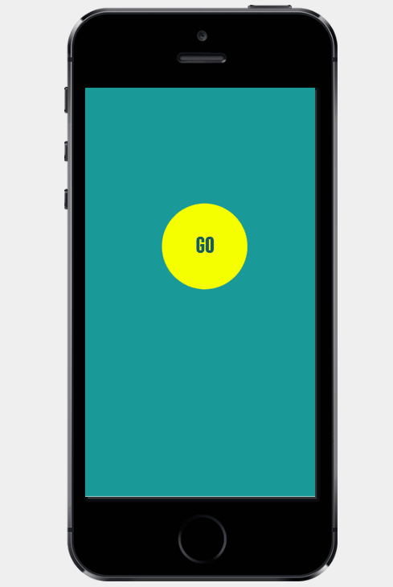
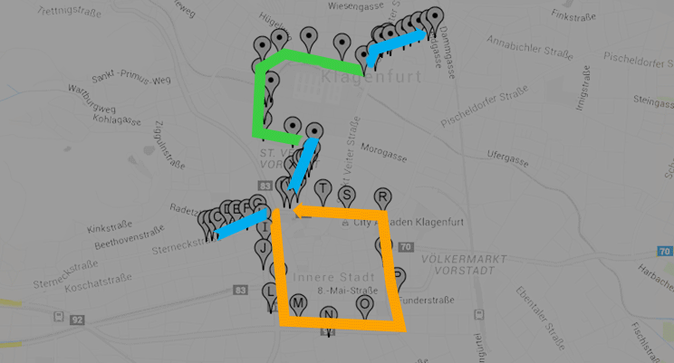

# GoHappy

The solution for the [„What the hack!“ hackathon](http://www.hackathon.click/) developed by the Austrian team. The event took place from 24.06.2016 till 26.06.2016 in St.Salvator 9361 (Austria). The main idea of the hackathon was to develop a mobility app for the region of Carinthia. 

## The Team KOO-KOO

 * Rafael Jonach
 * Sergii Zhevzhyk
 * Sven Graziani 
 * Channa Karunathilake

## The challenge

You travel to a destination using different means of transport (train, bus, taxi, car sharing, bike) and there is no need to buy any ticket because your mobile device will gather all the information about your trip, chooses the best option for you and registers each check-in and check-out in the different used vehicles along your journey accordingly to the distance.

## Our vision of the solution

Within a timeframe of 48 hours we implemented our vision of the future public transportation.

Imagine you wake up in the morning and prepare yourself for going out and there are many options of public transports to take... But do not worry -- the only thing you have to do is to **PUSH ONE BUTTON** on your phone or smart watch. Your friend can easily travel with you by another click. You can move to your destination without worrying about different tariffs or tickets on public transport. Click the stop button when you finished traveling. At the power of a fingertip you are enabled to use a taxi, a boat across the Wörthersee or enjoy the benefits of bike or car sharing. Plan your next trip by activating your travel assistant which gives you even more freedom to care about what really matters to you. Going to work, holidays or sports lessons: **DON'T WORRY -- GO HAPPY!**

## User interface

## Architecture

Our solution consists of:

 * **Hybrid application** which has easy to use UI and can work on the contemporary mobile platforms (Android, iOS, etc.).
 * **Backend** in the cloud which stores data, does calculations and provides the REST API for the mobile application.

## How we divided the tasks

We had a well balanced team that is why we could divide the tasks in the best possible way:

 * **Sven** prepare the hybrid application with the detailed design.
 * **Sergii** programmed the backend (database and REST API) and deployed it in the Azure cloud.
 * **Rafael** implemented the matching algorithms.
 * **Channa** wrote the native iOS application to test different features and improve user experience.

## Algorithms

There are three algorithms to provide the simplest transportation you've ever seen:

* **FiterIt** helps to find vehicles which are close to your location now.
* **MatchIt** matches the track of the user with the vehicle. 
* **ClusterIt** if we have a couple of matches we can use information from other anonymized users with assigned line to find the fitting line as soon as possible. 

## Acknowledgement

We would like to thank the organisers of the hackathon and everyone who came from the foreigh countries to take part in this event.
