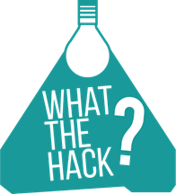

# GoHappy
The solution for the „What the hack!“ hackathon (http://www.hackathon.click/) developed by the Austrian team. The event took part from 24.06.2016 till 26.06.2016 in St.Salvator 9361 (Austria).

## The Team KOO-KOO

 * Sergii Zhevzhyk
 * Sven Graziani
 * Raphael Jonach
 * Channa Karunathilake

## The challenge

Within a timeframe of 48 hours we implemented our vision of the future public transportation:

## How we divided the tasks

